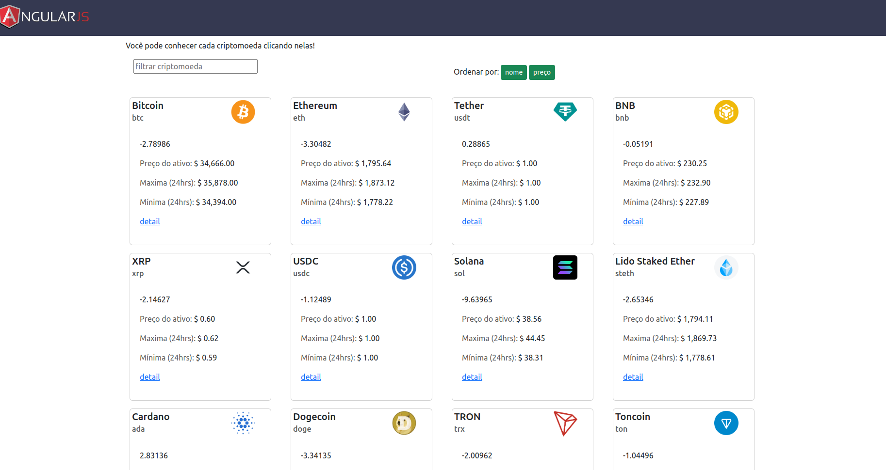

## AngularJs - consulta de Criptomoedas
- Criando uma aplicação com AngularJs para consultar criptomoedas

### Trabalhando com projetos Legados: Introdução ao AngularJS

A Digital Innovation One junto com a Take, criaram uma parceria
para que trilhas fossem criadas com o intuito de formar mais desenvolvedores
nessa aula vocês construíremos do zero uma aplicação em AngularJS.

- os arquivos para a aula estão no repositório público:
https://github.com/mhnakashima/dio-angularjs-base

 

- api de criptomoedas utilizada para consulta das criptomoedas:
    - URL = https://api.coingecko.com/api/v3/coins/markets?vs_currency=usd&order=market_cap_desc&per_page=100&page=1&sparkline=false&locale=en

### Para rodar a aplicação

- Baixar o repositório (zip) ou clonar na sua máquina - git clone https://github.com/mhnakashima/dio-angularjs-base
- Ter o node instalado **(https://nodejs.org/en/download/)**;
- Abrir pasta do projeto
- npm i

### Documentação

- https://docs.angularjs.org/guide

### Styleguide AngularJS (John Papa)
- https://github.com/johnpapa/angular-styleguide/blob/master/a1/README.md

### Algumas das principais diretivas que utilizamos
 
ng-app, ng-controller, ng-model, ng-class, ng-click, ng-repeat, ng-show & ng-hide, ng-switch, ng-if, ng-repeat, ng-style, ng-disabled, ng-required, ng-pristine, ng-dirty 

entre outras

